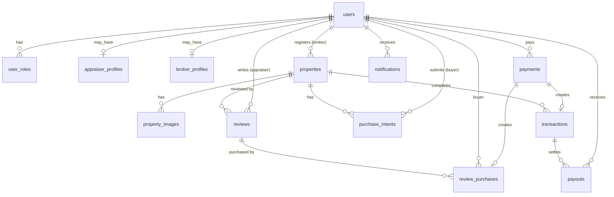

# 별땅 - DB 스키마 설계

문서 버전: v0.2 (PostgreSQL 16 기준)

> **v0.2 변경 요약**: 토큰 시스템 도입(`wallets`, `token_transactions`, `token_packages` 추가).
> 자세한 사항은 [09-Token-System.md](./09-Token-System.md). 본 문서의 §1~§6은 기본 스키마,
> 토큰 관련 추가/변경은 §7로 분리.

## 1. 설계 원칙

- **자연키 X / 대리키(UUID) O** — 모든 PK는 `uuid_generate_v4()`
- **소프트 삭제** — `deleted_at` 컬럼 (NULL = 활성)
- **타임스탬프** — `created_at`, `updated_at` (UTC)
- **금액** — `BIGINT` 사용. 단위는 컬럼별로 다름:
  - `payments.amount`: KRW (원)
  - `reviews.price`, `review_purchases.*`: **별(BYT)**
  - `properties.price`, `purchase_intents.offered_price`, `transactions.*`: KRW (원)
- **Enum** — Postgres `CHECK` 제약 + 애플리케이션 단 enum 매칭
- **인덱스** — FK + 자주 필터링되는 컬럼 (`status`, `region_code`, `category` 등)
- **권한 모델** — 한 사용자가 여러 역할을 가질 수 있음 (`user_roles` join 테이블)

## 2. ERD (Mermaid)



## 3. 테이블 정의

### 3.1. `users` — 모든 사용자 공통

| 컬럼 | 타입 | 제약 | 설명 |
|---|---|---|---|
| id | UUID | PK, default `uuid_generate_v4()` | |
| email | VARCHAR(255) | UNIQUE NOT NULL | 로그인 ID |
| password_hash | VARCHAR(255) | NOT NULL | bcrypt |
| name | VARCHAR(100) | NOT NULL | |
| phone | VARCHAR(20) | | E.164 |
| avatar_url | TEXT | | |
| email_verified_at | TIMESTAMPTZ | | |
| created_at | TIMESTAMPTZ | DEFAULT NOW() | |
| updated_at | TIMESTAMPTZ | DEFAULT NOW() | |
| deleted_at | TIMESTAMPTZ | | NULL = 활성 |

인덱스: `idx_users_email_unique`

### 3.2. `user_roles` — 역할 (다중)

| 컬럼 | 타입 | 제약 | 설명 |
|---|---|---|---|
| user_id | UUID | FK users(id), PK | |
| role | VARCHAR(20) | PK, CHECK IN ('buyer','appraiser','broker','admin') | |
| created_at | TIMESTAMPTZ | DEFAULT NOW() | |

### 3.3. `appraiser_profiles` — 감정평가사 프로필

| 컬럼 | 타입 | 제약 | 설명 |
|---|---|---|---|
| user_id | UUID | PK, FK users(id) | |
| license_no | VARCHAR(50) | NOT NULL | 감정평가사 자격번호 |
| license_image_url | TEXT | NOT NULL | 자격증 사본 (S3 키) |
| years_of_experience | INT | | |
| specialty | VARCHAR(255) | | "토지·빌딩" 등 |
| bio | TEXT | | 자기소개 |
| status | VARCHAR(20) | NOT NULL CHECK IN ('pending','approved','rejected','revoked') DEFAULT 'pending' | |
| approved_at | TIMESTAMPTZ | | |
| approved_by | UUID | FK users(id) | 관리자 |
| rejection_reason | TEXT | | |

### 3.4. `broker_profiles` — 공인중개사 프로필

| 컬럼 | 타입 | 제약 | 설명 |
|---|---|---|---|
| user_id | UUID | PK, FK users(id) | |
| office_name | VARCHAR(200) | NOT NULL | 부동산 사무소명 |
| license_no | VARCHAR(50) | NOT NULL | 중개사무소 등록번호 |
| office_address | VARCHAR(255) | | |
| status | VARCHAR(20) | NOT NULL CHECK IN ('pending','approved','rejected') DEFAULT 'pending' | |
| approved_at | TIMESTAMPTZ | | |

### 3.5. `properties` — 매물

| 컬럼 | 타입 | 제약 | 설명 |
|---|---|---|---|
| id | UUID | PK | |
| broker_id | UUID | FK users(id) NOT NULL | 등록 중개사 |
| title | VARCHAR(255) | NOT NULL | "더 힐즈 모던 하우스" |
| title_en | VARCHAR(255) | | "The Hills Modern" |
| category | VARCHAR(20) | NOT NULL CHECK IN ('apartment','villa','detached','officetel','commercial','land') | |
| address | VARCHAR(500) | NOT NULL | "서울특별시 용산구 한남동 123-45" |
| address_detail | VARCHAR(255) | | |
| region_code | VARCHAR(10) | NOT NULL | "11170" (행정구역 코드) |
| latitude | DECIMAL(10,7) | | |
| longitude | DECIMAL(10,7) | | |
| price | BIGINT | NOT NULL | 매매 호가 (원) |
| area_m2 | DECIMAL(10,2) | NOT NULL | 전용 면적 |
| rooms | INT | | 침실 |
| bathrooms | INT | | 욕실 |
| parking | INT | | 주차 대수 |
| build_year | INT | | 준공 연도 |
| description | TEXT | | |
| checklist | JSONB | DEFAULT '{}' | `{site_visit:true, registry_verified:true, ...}` |
| status | VARCHAR(20) | NOT NULL CHECK IN ('draft','active','sold','withdrawn') DEFAULT 'draft' | |
| is_premium | BOOLEAN | DEFAULT FALSE | "프리미엄 감정" 뱃지 노출 여부 |
| created_at | TIMESTAMPTZ | DEFAULT NOW() | |
| updated_at | TIMESTAMPTZ | DEFAULT NOW() | |
| deleted_at | TIMESTAMPTZ | | |

인덱스:
- `idx_properties_status_category (status, category)`
- `idx_properties_region (region_code)`
- `idx_properties_price (price)`
- `idx_properties_broker (broker_id)`

### 3.6. `property_images` — 매물 사진

| 컬럼 | 타입 | 제약 | 설명 |
|---|---|---|---|
| id | UUID | PK | |
| property_id | UUID | FK properties(id) NOT NULL | |
| url | TEXT | NOT NULL | S3 키 |
| thumbnail_url | TEXT | | |
| sort_order | INT | DEFAULT 0 | |
| is_main | BOOLEAN | DEFAULT FALSE | |
| created_at | TIMESTAMPTZ | DEFAULT NOW() | |

### 3.7. `reviews` — 감정평가사 리뷰 (전문가 소견)

| 컬럼 | 타입 | 제약 | 설명 |
|---|---|---|---|
| id | UUID | PK | |
| property_id | UUID | FK properties(id) NOT NULL | |
| appraiser_id | UUID | FK users(id) NOT NULL | |
| estimated_value | BIGINT | NOT NULL | 추정 가치 (원) |
| confidence_level | VARCHAR(20) | CHECK IN ('low','medium','high') | 신뢰도 |
| market_outlook | VARCHAR(20) | NOT NULL CHECK IN ('bullish','neutral','bearish') | 5년 전망 |
| outlook_reason | TEXT | NOT NULL | 전망 근거 |
| analysis_summary | TEXT | NOT NULL | 분석 요약 |
| evidence_urls | TEXT[] | DEFAULT '{}' | S3 키 배열 (최대 10) |
| price | BIGINT | NOT NULL | 리뷰 열람 가격 (원) |
| platform_fee_rate | DECIMAL(4,3) | NOT NULL DEFAULT 0.150 | 수수료율 (15%) |
| disclaimer_field_visit | BOOLEAN | NOT NULL | 실지조사 여부 |
| status | VARCHAR(20) | NOT NULL CHECK IN ('draft','published','archived') DEFAULT 'draft' | |
| published_at | TIMESTAMPTZ | | |
| rating_avg | DECIMAL(3,2) | DEFAULT 0 | (P2) 평균 평점 |
| rating_count | INT | DEFAULT 0 | (P2) |
| created_at | TIMESTAMPTZ | DEFAULT NOW() | |
| updated_at | TIMESTAMPTZ | DEFAULT NOW() | |
| deleted_at | TIMESTAMPTZ | | |

인덱스: `idx_reviews_property_status (property_id, status)`, `idx_reviews_appraiser (appraiser_id)`

UNIQUE: `(property_id, appraiser_id)` — 동일 평가사가 동일 매물에 1건 (오픈 이슈, MVP 가정)

### 3.8. `review_purchases` — 리뷰 결제·열람 권한

| 컬럼 | 타입 | 제약 | 설명 |
|---|---|---|---|
| id | UUID | PK | |
| review_id | UUID | FK reviews(id) NOT NULL | |
| buyer_id | UUID | FK users(id) NOT NULL | |
| payment_id | UUID | FK payments(id) NOT NULL | |
| price | BIGINT | NOT NULL | 결제 시점 가격 |
| platform_fee | BIGINT | NOT NULL | 플랫폼 수수료 금액 |
| appraiser_payout | BIGINT | NOT NULL | 평가사 정산 금액 |
| viewed_at | TIMESTAMPTZ | | 최초 열람 시각 (환불 가부 판정) |
| created_at | TIMESTAMPTZ | DEFAULT NOW() | |

UNIQUE: `(review_id, buyer_id)` — 한 매수자가 같은 리뷰 1회만

### 3.9. `purchase_intents` — 매수 의향서

| 컬럼 | 타입 | 제약 | 설명 |
|---|---|---|---|
| id | UUID | PK | |
| property_id | UUID | FK properties(id) NOT NULL | |
| buyer_id | UUID | FK users(id) NOT NULL | |
| broker_id | UUID | FK users(id) NOT NULL | (denorm) 알림 발송 편의 |
| offered_price | BIGINT | NOT NULL | 의향가 |
| desired_close_date | DATE | | 희망 클로징 일자 |
| message | TEXT | | 메모 |
| status | VARCHAR(20) | NOT NULL CHECK IN ('submitted','viewed','accepted','rejected','withdrawn') DEFAULT 'submitted' | |
| created_at | TIMESTAMPTZ | DEFAULT NOW() | |
| updated_at | TIMESTAMPTZ | DEFAULT NOW() | |

UNIQUE: `(property_id, buyer_id)` (재제출 시 UPDATE)

### 3.10. `payments` — 결제 (PG 트랜잭션)

| 컬럼 | 타입 | 제약 | 설명 |
|---|---|---|---|
| id | UUID | PK | |
| user_id | UUID | FK users(id) NOT NULL | 결제자 |
| pg_provider | VARCHAR(20) | NOT NULL CHECK IN ('toss','portone','manual') | |
| pg_tx_id | VARCHAR(100) | | PG 거래 ID |
| purpose | VARCHAR(20) | NOT NULL CHECK IN ('review','transaction_fee') | 결제 목적 |
| target_id | UUID | NOT NULL | review_id 또는 transaction_id |
| amount | BIGINT | NOT NULL | |
| currency | VARCHAR(3) | NOT NULL DEFAULT 'KRW' | |
| status | VARCHAR(20) | NOT NULL CHECK IN ('pending','succeeded','failed','refunded') DEFAULT 'pending' | |
| failure_reason | TEXT | | |
| paid_at | TIMESTAMPTZ | | |
| refunded_at | TIMESTAMPTZ | | |
| created_at | TIMESTAMPTZ | DEFAULT NOW() | |

인덱스: `idx_payments_user (user_id)`, `idx_payments_pg_tx (pg_tx_id)`

### 3.11. `transactions` — 부동산 거래 (성사된 매매 건)

| 컬럼 | 타입 | 제약 | 설명 |
|---|---|---|---|
| id | UUID | PK | |
| property_id | UUID | FK properties(id) NOT NULL | |
| buyer_id | UUID | FK users(id) NOT NULL | |
| broker_id | UUID | FK users(id) NOT NULL | |
| sale_price | BIGINT | NOT NULL | 실거래가 |
| broker_fee | BIGINT | NOT NULL | 중개 수수료 (3% 가정) |
| platform_fee | BIGINT | NOT NULL | 플랫폼 수수료 (5% 가정) |
| appraiser_bonus_total | BIGINT | NOT NULL DEFAULT 0 | 결제된 리뷰 작성자에게 추가 보너스 |
| total_fee | BIGINT | NOT NULL | broker_fee + platform_fee + appraiser_bonus_total |
| status | VARCHAR(20) | NOT NULL CHECK IN ('reported','verified','settled','disputed') DEFAULT 'reported' | |
| contract_doc_url | TEXT | | 계약서 사본 (S3) |
| reported_at | TIMESTAMPTZ | DEFAULT NOW() | |
| verified_at | TIMESTAMPTZ | | |
| verified_by | UUID | FK users(id) | 관리자 |
| settled_at | TIMESTAMPTZ | | |

### 3.12. `payouts` — 정산 항목 (Ledger)

| 컬럼 | 타입 | 제약 | 설명 |
|---|---|---|---|
| id | UUID | PK | |
| transaction_id | UUID | FK transactions(id) | 거래 정산일 때 |
| review_purchase_id | UUID | FK review_purchases(id) | 리뷰 정산일 때 |
| recipient_id | UUID | FK users(id) NOT NULL | 수취인 |
| recipient_role | VARCHAR(20) | NOT NULL CHECK IN ('platform','broker','appraiser') | |
| label | VARCHAR(255) | NOT NULL | "EvalEstate 거래 중개 플랫폼 수수료" 등 |
| amount | BIGINT | NOT NULL | |
| status | VARCHAR(20) | NOT NULL CHECK IN ('pending','paid','failed') DEFAULT 'pending' | |
| paid_at | TIMESTAMPTZ | | |
| created_at | TIMESTAMPTZ | DEFAULT NOW() | |

CHECK: `(transaction_id IS NOT NULL) <> (review_purchase_id IS NOT NULL)` — 둘 중 하나만

### 3.13. `notifications` — 인앱 알림

| 컬럼 | 타입 | 제약 | 설명 |
|---|---|---|---|
| id | UUID | PK | |
| user_id | UUID | FK users(id) NOT NULL | |
| type | VARCHAR(50) | NOT NULL | `'intent_received', 'review_purchased', 'payout_settled', ...` |
| title | VARCHAR(255) | NOT NULL | |
| body | TEXT | | |
| link | TEXT | | 클릭 시 이동 URL |
| read_at | TIMESTAMPTZ | | NULL = 미읽음 |
| created_at | TIMESTAMPTZ | DEFAULT NOW() | |

인덱스: `idx_notifications_user_read (user_id, read_at)`

## 4. 정산 계산 예시 (디자인 PDF의 transaction-summary 기준)

```
sale_price        =  ₩850,000,000
platform_fee (5%) =   ₩42,500,000
broker_fee   (3%) =   ₩25,500,000
appraiser_bonus   =    ₩5,000,000  (= 리뷰 결제분 ×2건의 추가 보너스)
─────────────────────────────────
total_fee         =   ₩73,000,000
buyer_total_pay   =  ₩923,000,000  (sale + total_fee)
```

`payouts` 4 row 생성:
1. broker  → ₩25,500,000
2. platform → ₩42,500,000
3. appraiser A → ₩2,500,000
4. appraiser B → ₩2,500,000

## 5. 인덱스/성능 참고

- `properties` 검색은 region/category/price/status 복합 필터가 잦음 → `idx_properties_search (status, category, region_code, price)` 추가 검토
- 매물 상세에서 리뷰 N개 + 평가사 프로필 JOIN — N+1 방지 위해 ORM에서 `selectinload` / Prisma `include`
- `notifications` 미읽음 카운트 — `read_at IS NULL` 부분 인덱스 사용

## 6. 마이그레이션 도구

- **Alembic** (SQLAlchemy 표준) — `alembic/versions/` 에 순차 파일
- 초기 마이그레이션: `0001_initial.py` (위 13개 테이블 + extension `pgcrypto`)
- 토큰 시스템 마이그레이션: `0002_token_system.py` (`wallets`, `token_transactions`, `token_packages` 추가 + `payments.purpose` enum 확장 + `review_purchases.payment_id` NULLABLE)
- 시드 데이터: `scripts/seed.py` (관리자 1, 평가사 2, 중개사 2, 매수자 1, 매물 6, 리뷰 7, 토큰 패키지 4, 매수자 초기 잔액 1,500별)

## 7. 토큰 시스템 추가 테이블 (v0.2)

자세한 설계는 [09-Token-System.md](./09-Token-System.md) 참고. 핵심 요약:

### 7.1. `wallets`

| 컬럼 | 타입 | 비고 |
|---|---|---|
| user_id | UUID PK FK users | CASCADE delete |
| balance_tokens | BIGINT NOT NULL DEFAULT 0 | CHECK ≥ 0 |
| total_charged | BIGINT NOT NULL DEFAULT 0 | 누적 충전 |
| total_spent | BIGINT NOT NULL DEFAULT 0 | 누적 사용 |
| total_earned | BIGINT NOT NULL DEFAULT 0 | 누적 적립 |
| updated_at | TIMESTAMPTZ | onupdate=now() |

### 7.2. `token_transactions` (Ledger)

| 컬럼 | 타입 | 비고 |
|---|---|---|
| id | UUID PK | |
| user_id | UUID FK users | INDEX |
| direction | VARCHAR(3) | CHECK: 'in' / 'out' |
| type | VARCHAR(30) | charge / spend_review / earn_review_sale / refund / admin_adjust |
| tokens | BIGINT | CHECK > 0 (절대값) |
| balance_after | BIGINT | 트랜잭션 후 잔액 |
| related_id | UUID NULL | review/payment id |
| related_type | VARCHAR(30) NULL | |
| memo | TEXT NULL | |
| created_at | TIMESTAMPTZ | |

인덱스: `(user_id, created_at desc)`, `(related_type, related_id)`

### 7.3. `token_packages`

| 컬럼 | 타입 | 비고 |
|---|---|---|
| id | UUID PK | |
| code | VARCHAR(30) UNIQUE | 'starter' / 'basic' / 'pro' / 'vvip' |
| name | VARCHAR(100) | 표시명 |
| price_krw | INT | KRW |
| tokens | INT | 기본 지급 별 |
| bonus_tokens | INT DEFAULT 0 | 보너스 별 |
| is_active | BOOL DEFAULT TRUE | |
| sort_order | INT DEFAULT 0 | |
| description | TEXT NULL | |

### 7.4. 변경된 기존 테이블

| 테이블 | 컬럼 | 변경 |
|---|---|---|
| `payments` | `purpose` | CHECK enum에 `'token_charge'` 추가 |
| `review_purchases` | `payment_id` | **NULLABLE**로 변경 (토큰 차감은 PG 호출 없음) |
| `reviews` | `price` | 의미: KRW → **별(BYT)** |
| `review_purchases` | `price`, `platform_fee`, `appraiser_payout` | 의미: KRW → **별(BYT)** |
